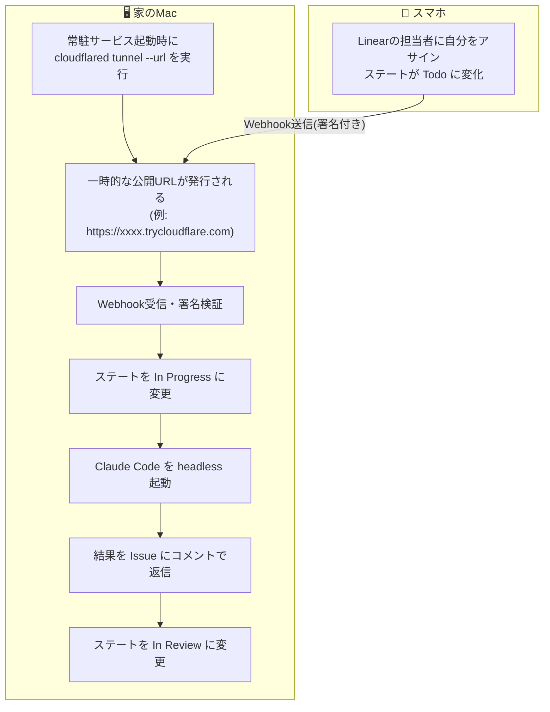
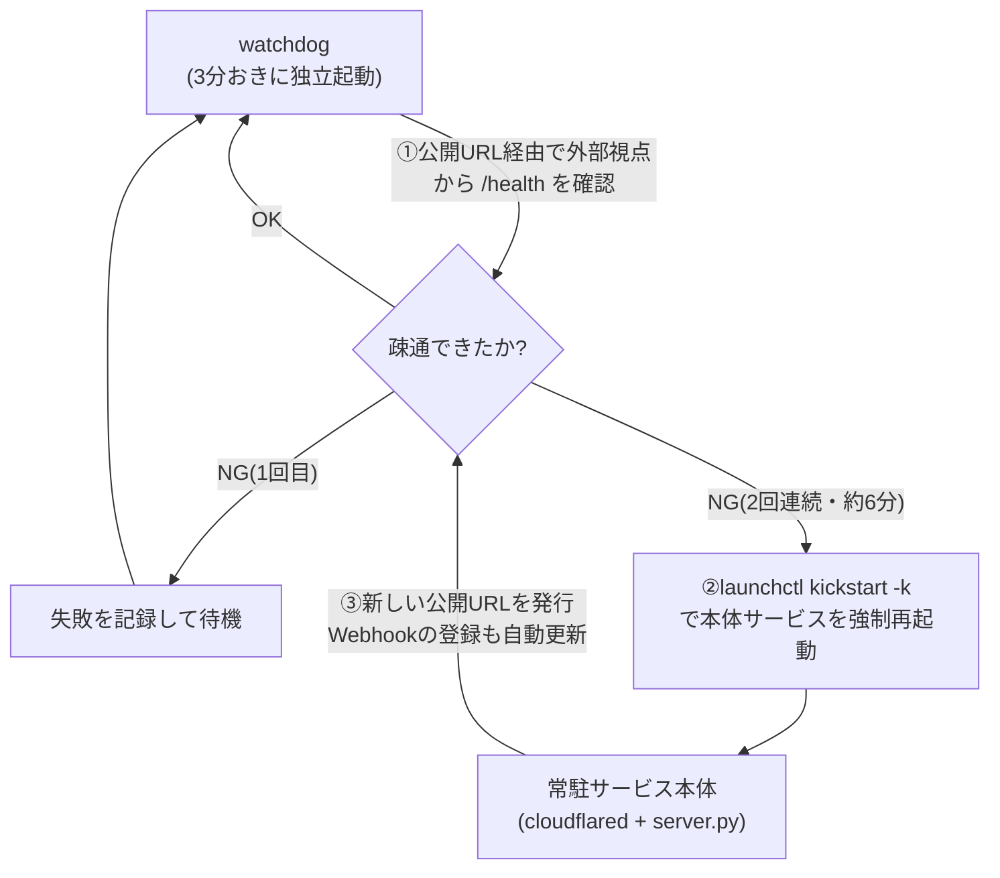

# はじめに

「スマホからLinearに指示を出して、家のPCでClaude Codeに開発してもらう」というテーマ自体は、すでにいくつも記事があります。GitHub Actions上でLinearの通知を受けてClaude Codeを動かすものや、明示的なコマンドでリモート操作するものなど、アプローチは様々です。

これを**コマンド不要、Issueをアサインするだけ**で成立させようとすると、必然的に「常駐サービスが四六時中起動していて、いつ指示が来ても確実に反応できる」ことが前提になります。もし常駐サービスの一部だけが気づかないうちに止まっていたら、スマホ側からは「アサインしたのに何も起きない」という、原因の分かりにくい失敗になってしまいます。

つまり、コマンドレスな操作感を実現するためには、その裏で**常駐サービスを24時間動かし続けるための設計**が必要になる、ということです。この記事ではその部分にフォーカスします。具体的には次の2点です。

- コマンドを打たなくても、Issueのステートを変えるだけで発火する
- ネットワーク経路の一部だけが切れる、というlaunchdのプロセス監視では検知できない障害を、どう自動復旧させるか

# 全体の仕組み

ローカルMac上でPython製の常駐サービスが動いており、LinearからのWebhookを受け取れるように、起動のたびにCloudflareの一時トンネル(`cloudflared tunnel --url`)で自分自身を一時的にインターネットへ公開しています。

ポイントは、常駐サービス自身が起動のたびに`cloudflared`を子プロセスとして立ち上げ、一時的な公開URLを自分で発行している点です。外部の中継サービスを別途契約するのではなく、サービス自身が「今だけの入り口」を毎回作り直すイメージです。

ポイントは、Webhookの送信元をLinearに限定するために署名検証を行っている点と、Issueのステート変化そのものをトリガーにしている点です。「特定のコマンドを打つ」という一手間が要らないぶん、スマホ側の操作は「担当者にアサインする」だけで済みます。

トンネルURLは起動のたびに新しく発行されますが、これをLinearに伝える作業も人手を介しません。常駐サービスは起動時に、以前作成したWebhookのIDを覚えていれば、LinearのGraphQL API(`webhookUpdate`)を呼んでそのWebhookの`url`を新しいトンネルURLに書き換えます。まだWebhookを作っていなければ`webhookCreate`で新規作成します。つまり「URLをLinearに登録し直す」という作業自体もサービス自身がAPI経由で行っており、再起動してURLが変わっても手動での再設定は不要です。

# 「プロセスは生きているのに繋がらない」問題

このタイプの常時稼働サービスで一番厄介なのは、プロセス自体はクラッシュしていないのに、外部からの疎通だけができなくなるケースです。今回の構成では、トンネル接続だけが切れて常駐サービス本体は正常に動き続けている、という状態が起こり得ます。

この症状の主な原因は、トンネル内部で使われているQUIC(UDPベースの通信プロトコル)のタイムアウトです。QUICはTCPと違って明示的な切断シグナルを伴わないため、たとえばWi-Fiが一瞬途切れたときや、スリープから復帰した直後など、経路のどこかでパケットが届かなくなっても、双方はすぐには気づけません。数十秒単位の無応答が続いて初めて「切れている」と判断される仕組みになっており、その間もcloudflared自体のプロセスは起動したまま再接続を試み続けます。結果として、`ps`やlaunchdの目線では終始「正常に動いている」ようにしか見えません。

macOSのlaunchdには`KeepAlive`でプロセスの生存を監視し、落ちたら自動再起動する仕組みがありますが、これは「プロセスが存在するかどうか」しか見ていません。トンネルが切れているだけの状態では、プロセスは生きているためlaunchdは何もしてくれず、結果としてLinear側からのWebhookが永久に届かなくなります。

# 外部疎通を監視する専用のwatchdog

この問題に対して、サービス本体とは別プロセスの監視役(watchdog)を用意し、次のように動かしています。

- launchdの`StartInterval`で3分おきに独立起動する
- 本体が実際に公開している公開URL経由で、外部から`/health`エンドポイントを叩いて疎通を確認する(ローカルからではなく、あえて外部視点で確認するのがポイント)
- 2回連続(約6分間)で疎通に失敗したら、`launchctl kickstart -k`で本体サービスを強制再起動する
- 再起動によって新しいトンネルが張られ、Webhookの登録URLも自動的に更新される
- 本体が意図的に停止されている場合は何もしない(誤検知で勝手に起動し直さないようにするため)

watchdogを加えると、監視・復旧のループは次のようになります。

本体の生死ではなく、本体が「外の世界からちゃんと見えているか」をwatchdogが別プロセスとして定期的に確認し続け、ダメなら強制再起動で新しいトンネルを張り直す、というループです。

「プロセスの死活監視」と「外部から見た疎通の監視」を分離し、後者を別プロセスに切り出すことで、launchdの標準機能だけではカバーしきれない障害クラスに対応しています。ログも、異常検知・再起動が発生したときだけ記録するようにしており、平常時は無音です。

この構成にも限界はあります。再起動のタイミングでちょうどIssueを処理中だった場合、その実行は中断されます。今の実装では「ステートがIn Progressのまま止まっていたら、Todoに戻せば再実行される」という運用でカバーしていますが、処理の再開そのものを自動化しているわけではありません。

# まとめ

「スマホから指示してAIに開発させる」を実現するだけなら、選択肢はいろいろあります。この記事で紹介したのは、それを**自宅の1台のMacで、コマンドレスかつ止まらずに動かし続ける**ための、監視・復旧まわりの設計でした。

- ステート変化だけをトリガーにして、スマホ側の操作を最小化する
- プロセスの死活監視と外部疎通の監視を分けて考える
- 監視専用プロセスを軽量に(平常時は無音のログ)保つ

同じような常駐サービスを個人のマシンで動かす際の、障害設計の参考になれば幸いです。
