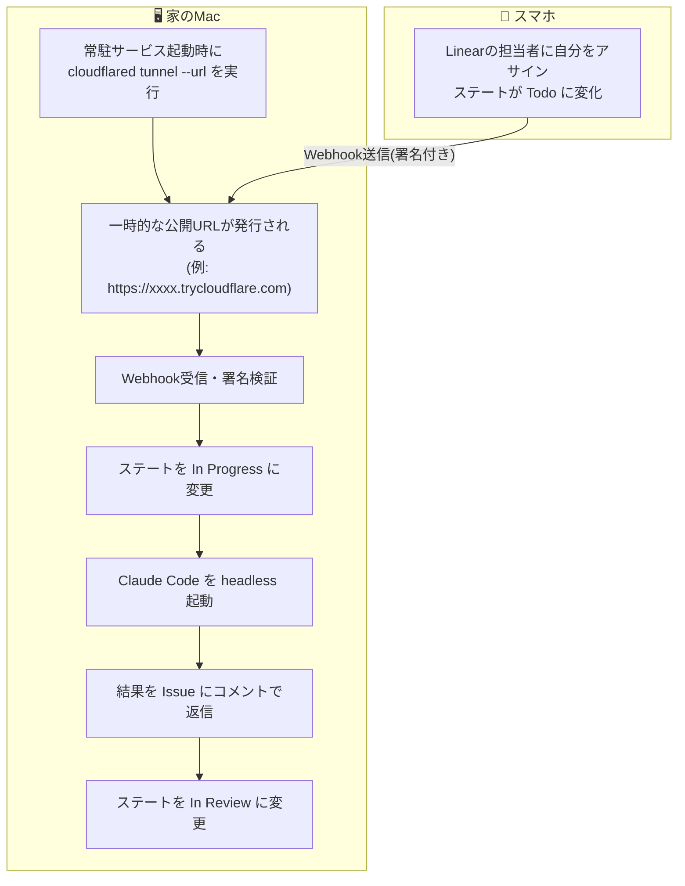
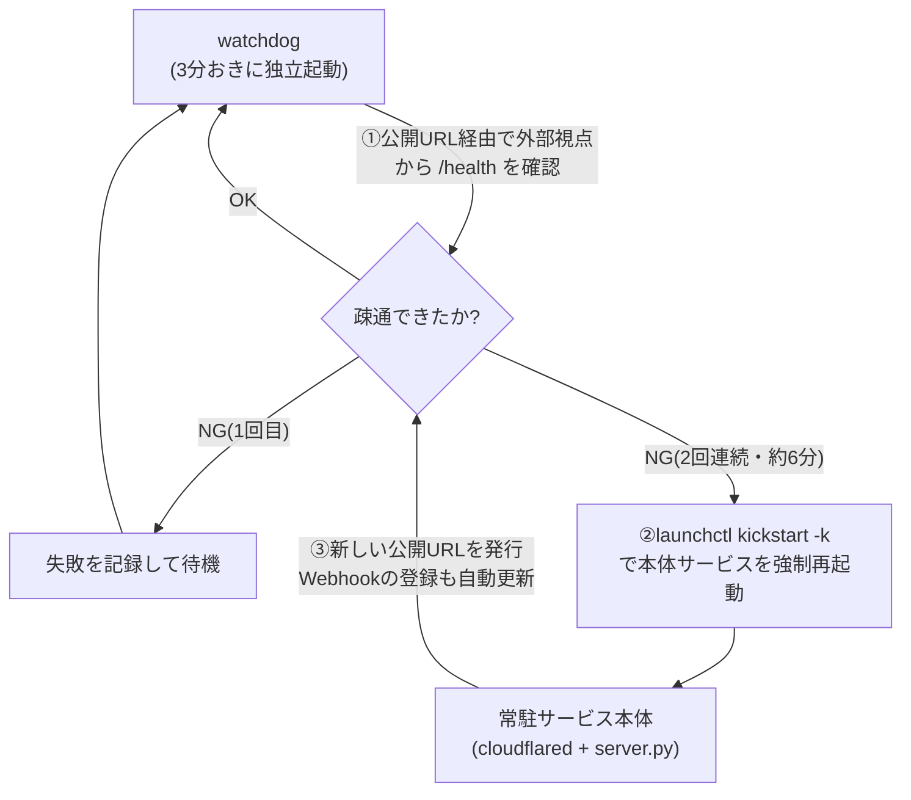

# はじめに

「スマホからLinearで指令を出して、家のPCのClaude Codeに開発してもらう」というテーマ自体は、既にいくつも記事があります。GitHub Actions上でLinearの通知を受けてClaude Codeを動かすものや、明示的なコマンドでリモート操作するものなど、アプローチは様々です。

今回は、これをさらに手軽に行うために、Linearで、**コマンドレス、かつ、IssueをアサインするだけでローカルのPCのClaude Codeが常に動く** 環境を整えました。この記事では、その環境を整えるために行った大きく２つの内容を説明します。
1. コマンドレスで、IssueをアサインするだけでClaude Codeが動く仕組み
2. 常に動かすために、ネットワーク経路の一部だけが切れた状態を、どう検知し自動復旧させるか

# Linear上の操作から家のClaude Codeが動く仕組み

ローカルMac上でPython製の常駐サービスが動いており、LinearからのWebhookを受け取れるように、起動のたびにCloudflareの一時トンネル(`cloudflared tunnel --url`)で自分自身を一時的にインターネットへ公開しています。

ポイントは、Linear上での操作の手軽さのために、Issueのステート変化そのものをトリガーにしている点です。「特定のコマンドを打つ」という一手間が要らないぶん、スマホ側の操作は「担当者にアサインする」だけで済みます。

# ネットワーク上の障害検出と自動復旧

このタイプの常時稼働サービスで一番厄介なのは、プロセス自体はクラッシュしていないのに、外部からの疎通だけができなくなるケースです。今回の構成では、トンネル接続だけが切れて常駐サービス本体は正常に動き続けている、という状態が起こり得ます。

この症状は、たとえばWi-Fiが一瞬途切れたときや、スリープから復帰した直後など、経路のどこかでパケットが届かなくなった場合に発生します。

macOSのlaunchdには`KeepAlive`でプロセスの生存を監視し、落ちたら自動再起動する仕組みがありますが、これは「プロセスが存在するかどうか」しか見ていません。トンネルが切れているだけの状態では、プロセスは生きているためlaunchdは何もしてくれず、結果としてLinear側からのWebhookが永久に届かなくなります。

この問題に対して、サービス本体とは別プロセスの監視役(watchdog)を用意し、次のように動かしています。

- launchdの`StartInterval`で3分おきに独立起動する
- 本体が実際に公開している公開URL経由で、外部から`/health`エンドポイントを叩いて疎通を確認する
- 2回連続(約6分間)で疎通に失敗したら、`launchctl kickstart -k`で本体サービスを強制再起動する
- 再起動によって新しいトンネルが張られ、Webhookの登録URLも自動的に更新される
- 本体が意図的に停止されている場合は何もしない(誤検知で勝手に起動し直さないようにするため)

監視・復旧のループは次のようになります。

サービス本体の生死ではなく、本体が「外の世界からちゃんと見えているか」をwatchdogが別プロセスとして定期的に確認し続け、ダメなら強制再起動で新しいトンネルを張り直す、というループです。

「プロセスの死活監視」と「外部から見た疎通の監視」を分離し、後者を別プロセスに切り出すことで、launchdの標準機能だけではカバーしきれない障害に対応しています。

# まとめ

「スマホから指示してAIに開発させる」を実現するだけなら、選択肢はいろいろあります。この記事で紹介したのは、それを**手軽に、かつ、ローカルPC上で常に動かし続ける**ための仕組でした。

それでは快適なAI駆動開発をお楽しみください。
